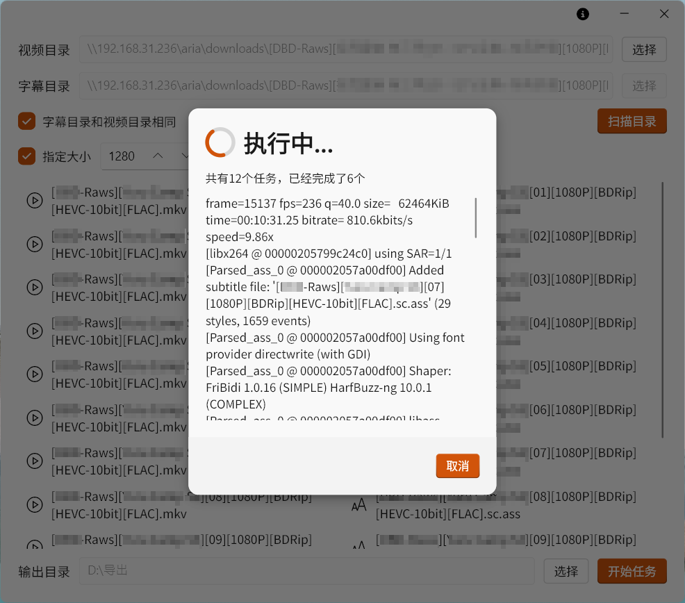

# Subs

</img>

## 截图

## 注意事项

- 这是一个从原`Subs`仓库(已被删除)迁移的仓库
- 不支持Windows7
- 字幕文件必须是utf-8编码

## 更新日志

### 1.2.0 (2024/11/21)
- 添加日志输出
- 添加指定分辨率
- 添加许可证页
- 修复输出编码问题，现在固定为H.264

过去的版本

### 1.1.1 (2024/10/21)
- 添加任务完成的提示
- 添加保存输出文件夹的功能

### 1.1.0 (2024/10/20)
- 重置了本软件

