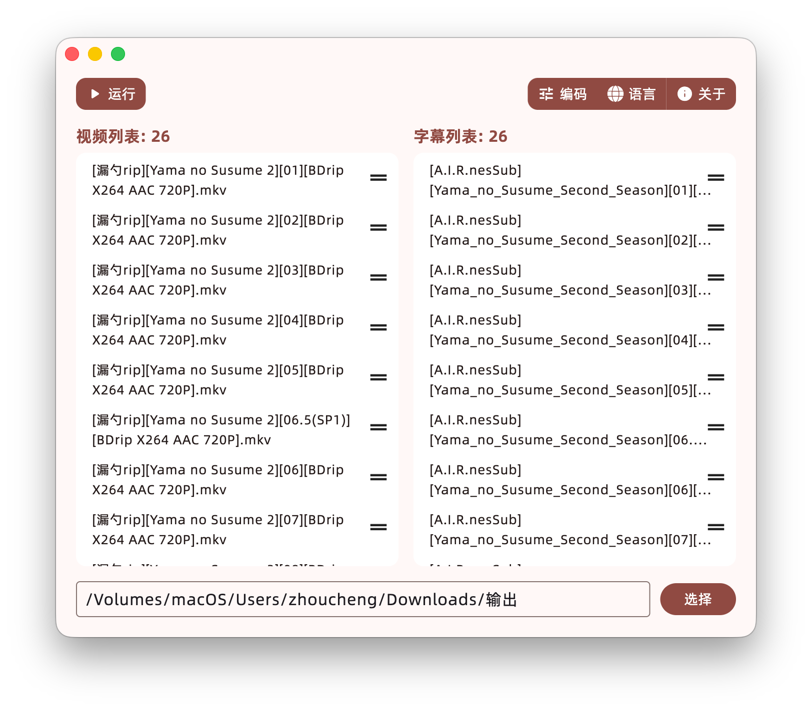
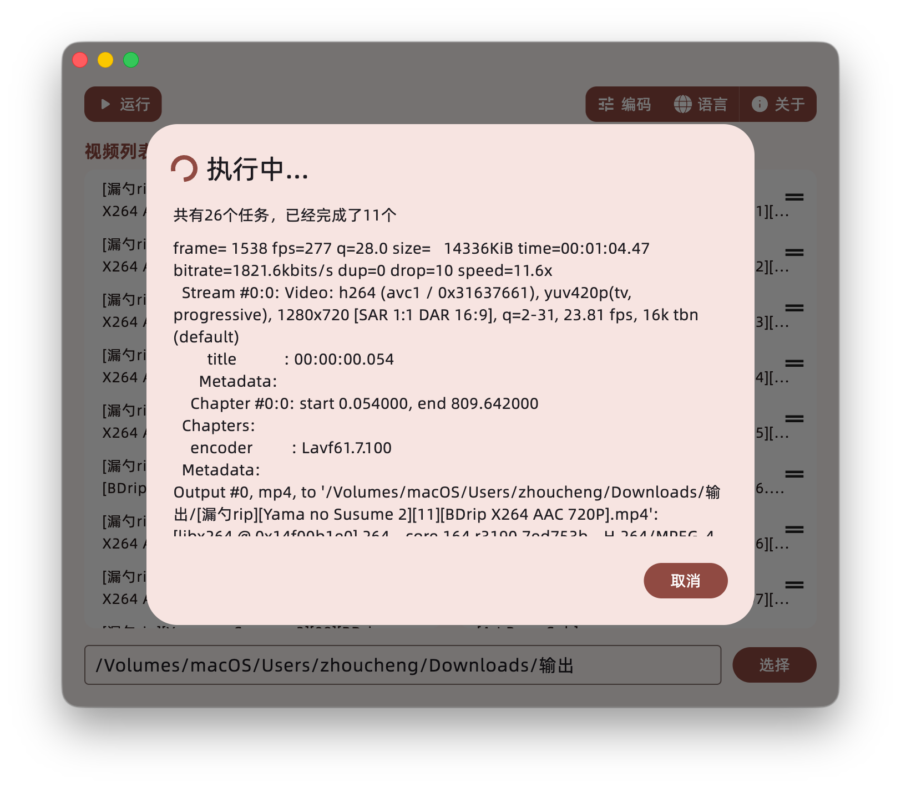

# Subs

## 简介

</img>

这是一个批量处理字幕的工具，帮助你批量压制多个视频+字幕，详细见[使用方法](#使用方法)

## 截图

</img>  
</img>

## 使用方法

> [!WARNING]
> 如果字幕文件不是utf-8编码，可能会导致失败，你可以使用本仓库的`tools/convert.py`进行转换

1. 将视频和字幕分别放在两个文件夹，放在一起也行
2. 需要字幕文件数量和视频文件数量相同后才能运行（你可以在添加完成之后自行删除/调整顺序）
3. 打开本软件，选择视频文件夹和字幕文件夹或者拖入对应区域
4. 如果你需要指定输出视频配置（比如分辨率和编码）可以点击`编码`配置，默认情况下输出视频编码为H264，音频编码为acc，分辨率和原始相同
5. 在窗口底部选择输出目录
6. 点击运行即可