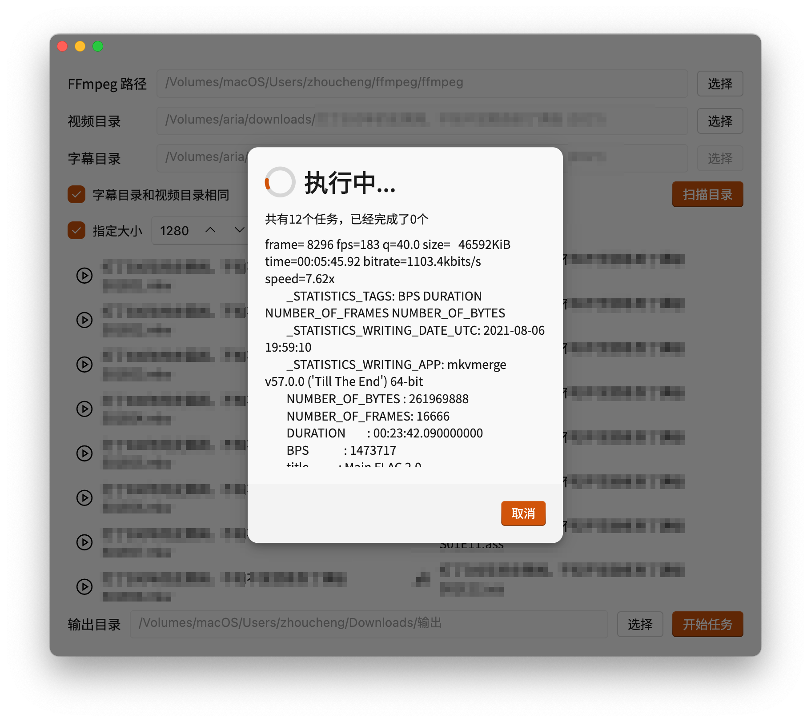

# Subs

</img>

## 截图



## 使用方法
0. 下载FFmpeg并且加入到系统的环境变量
1. 将视频和字幕分别放在两个文件夹，放在一起也行
2. 确保字幕文件数量和视频文件数量相同，程序会按照文件命名排序的规则配对
    ```
    video1.mp4 -> subtitle1.ass
    video2.mp4 -> subtitle2.ass
    ...
    ```
3. 打开本软件，选择视频文件夹和字幕文件夹（如果相同可以勾选`字幕目录和视频目录相同`）
4. 如果你需要指定视频分辨率可以勾选指定大小，然后输入你想要输出的分辨率（如果不勾选的话会以原始分辨率输出）
5. 选择扫描目录分析视频文件夹和字幕文件夹，扫描完成会提示视频和字幕数量（只有数量相同才能开始任务）
6. 在窗口底部选择输出目录
7. 点击开始任务等待任务完成即可！


## 注意事项

- 这是一个从原`Subs`仓库(已被删除)迁移的仓库
- 不支持Windows7
- 字幕文件必须是utf-8编码

## 更新日志

### 1.2.0 (2024/11/21)
- 添加日志输出
- 添加指定分辨率
- 添加许可证页
- 修复输出编码问题，现在固定为H.264

<details>
<summary>过去的版本</summary>

### 1.1.1 (2024/10/21)
- 添加任务完成的提示
- 添加保存输出文件夹的功能

### 1.1.0 (2024/10/20)
- 重置了本软件

</details>