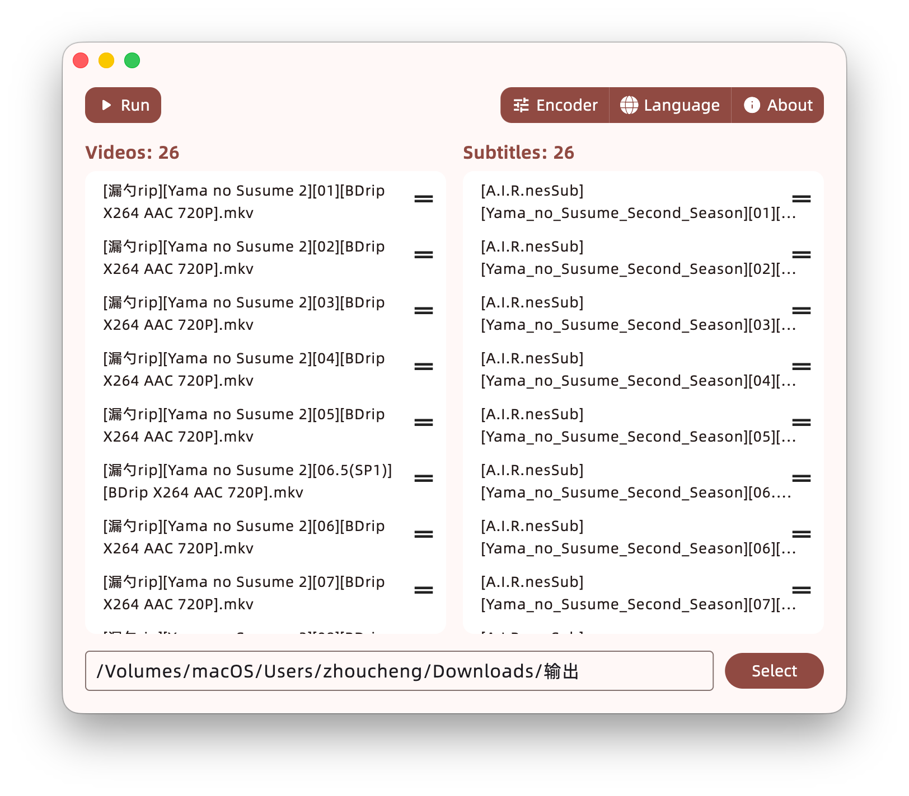
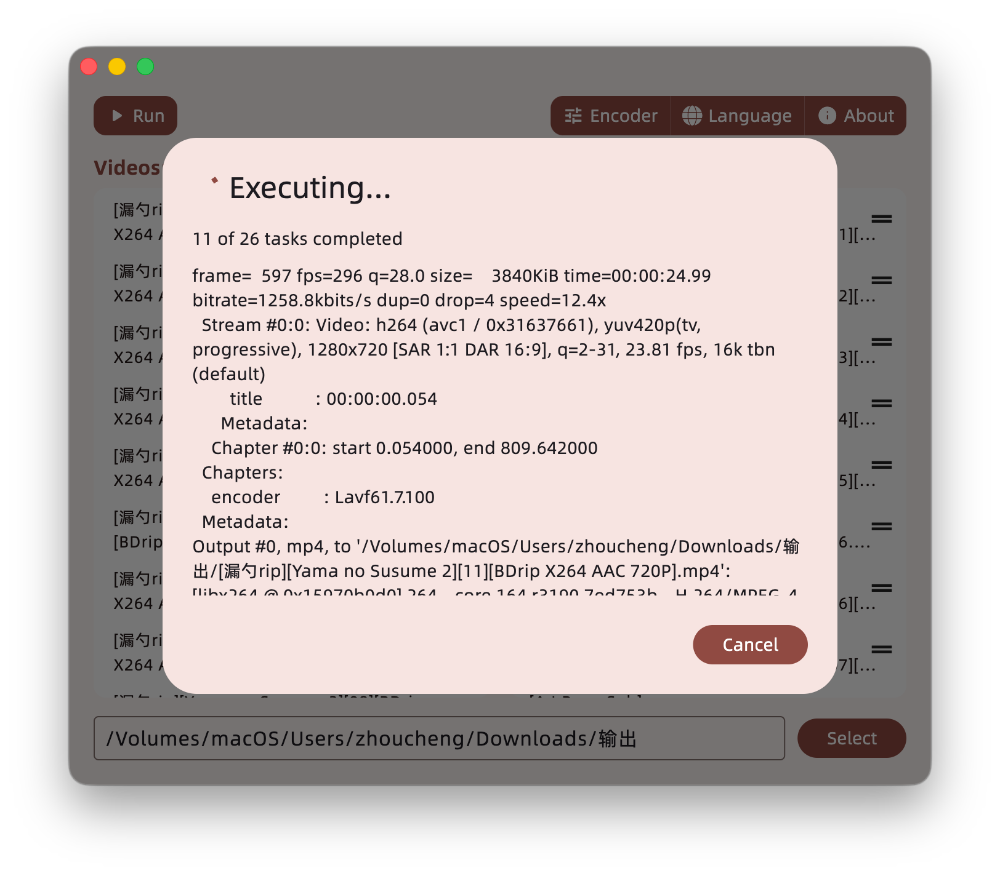

# Subs

## Introduction

</img>

This is a batch subtitle processing tool that helps you burn subtitles into multiple videos at once. For more details, see [Usage](#usage).

## Screenshots

</img>  
</img>

## Usage

> [!WARNING]
> If the subtitle files are not encoded in UTF-8, the process may fail. You can use `tools/convert.py` in this repository to convert them.

1. Place the videos and subtitles into two separate folders, or keep them together in the same folder.
2. The number of subtitle files must match the number of video files to run (you can delete items or adjust their order after they are added).
3. Open the software, select the video and subtitle folders, or drag and drop them into the corresponding areas.
4. If you need to specify custom output configurations (such as resolution and codec), you can click the `Codec` configurations. By default, the output video codec is H264, the audio codec is AAC, and the resolution remains the same as the original.
5. Select the output directory at the bottom of the window.
6. Click Run to start.